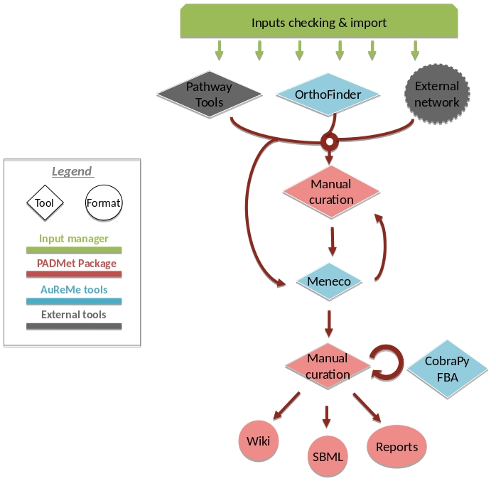

AuReMe documentation

.. _default_aureme:

How to use the AuReMe workspace (default workflow)
==================================================
AuReme is deployed in a Docker image. Thanks to this Docker image, all the
tools inside the AuReMe workspace are ready to use inside the AuReMe
container.

Requirements
------------

* Create your Docker container as explained in the previous step
  :ref:`run_docker`, start the container and go inside.

.. _new_study:

Start a new study
'''''''''''''''''

* Use the following command to start a new study. Choose an identifier
  for this study (ex: replace **test** by your organism name). In
  order to illustrate this documentation, we will use **test** as a
  run identifier.
  ::
     aureme> aureme --init=test

 Now you will find on your own computer (host), in your **bridge**
 directory, a folder **test** with many subdirectory and files.
 This is your work directory, on which AuReMe is going to run.

.. note:: Notice that from now until the end of the process, every command
	  will be stored as a log in the **bridge > test > log.txt** file.
	  The whole output of these commands will also be stored in the
	  **bridge > test > full_log.txt** file.
	  
	  If you wish NOT to store such logs, you can use the **quiet**
	  argument in your command(s). This will redirect the output on
	  the terminal. For example:
	  ::
	   aureme> aureme --run=test --cmd="some_command" -q
      
For further details on the log files, please see the :ref:`log_file` chapter.

* To get an overview of AuReMe, you can get a sample by using this
  command.
  ::
    au> aureme --run=test --sample

    
.. _database:

Define the reference database
'''''''''''''''''''''''''''''

* The final step is to define which reference database to use. The
  available databases are listed in your terminal when you create a new
  study. If needed, use this command to display them again.
  ::
   aureme> aureme --run=test --cmd="getdb" -q
   Available database in Aureme:
   /home/data/database/BIGG/bigg
   /home/data/database/BIOCYC/METACYC/20.5/metacyc_20.5_enhanced
   /home/data/database/BIOCYC/METACYC/22.0/metacyc_22.0_enhanced
   /home/data/database/MODELSEED/modelSeed

This reference database is needed to:

- Be able to match all the identifiers of the entities of metabolic networks.
- Gap-fill the metabolic network in the gap-filling step.
- Uniforms the data in one unique database.

To select one of the above databases, replace the corresponding path in the
configuration file: **config.txt**, in the **DATA_BASE** variable, or comment
the line if you don’t want/can’t use a database.

The **config.txt** file is stored at the root of your **test** folder.

The default workflow
--------------------

By default, the AuReMe workspace includes an automatic workflow for
metabolic network reconstruction. This workflow runs several
pre-installed tools and generates diverse output files. The process can
be either run entirely in a single command, or run step by step to
personalize it or do some intermediary analysis.

For instance, if you run the **draft** command (see :ref:`merge`),
it will run all the previous steps automatically
as described in the following figure. This figure details the steps of
the default workflow.

	    
.. _organization:

Data organization
-----------------

.. _bridge:

Bridge structure
''''''''''''''''

The **bridge** directory will store all your input data you will
provide, and all the result files the workflow is going to create.
In this section, all the **bridge** sub-directories will be described.

+------------------------------------------------------------+----------------------------------------+
| | **analysis**: All output files of the analysis processes.| .. image:: pictures/directories.png    |
|                                                            |    :scale: 80%                         |
| | **annotation_based_reconstruction**: If you want to use  |    :alt: Bridge directory content      |
| | annotated genomes (to run the annotation-based recons-   |                                        |
| | truction part of the workflow), put here all the output  |                                        |
| | files of the annotation tool. For instance with          |                                        |
| | Tools, copy-paste the whole PGDB                         |                                        |
| | :ref:`annotation` for more details).                     |                                        |
|                                                            |                                        |
| | **database**: If you want to use your own database put in|                                        |
| | this folder your database in padmet format, if you have a|                                        |
| | sbml convert this file to padmet (see                    |                                        |
| | :ref:`formats`). Don't forget                            |                                        |
| | to update the **config.txt** file after transforming your|                                        |
| | database into the padmet format.                         | | data from the **orthology_based_**   |
|                                                            | | **reconstruction** directory (if you |
| | **gapfilling/original_output**: If you run the metabolic | | have run this part of the workflow). |
| | network reconstruction with gap-filling, will contain all|                                        |
| | the output files of gap-filling tools before any post-   |                                        |
| | process from AuReMe (see the :ref:`gap-filling` section).|                                        |
|                                                            |                                        |
| | **genomic-data**: The directory in which to put the      |                                        |
| | genomic data on your studied organism, that is to say    |                                        |
| | either a Genbank (**GBK_study.gbk**) or a proteome       | | **orthology_based_reconstruction**:  |
| | (**FAA_study.faa**).                                     | | If you want to use model organisms   |
|                                                            | | (to run orthology-based reconstruc-  |
| | **growth_medium**: Description of the set of metabolites | | tion part of the workflow), put here |
| | that is available to initiate the metabolism (growth me- | | the proteome (**FAA_model.faa** or   |
| | dium), that is to say the seed compounds (**seeds.txt**  | | **GBK_model.gbk**) and the metabolic |
| | and **artefacts.txt**), see :ref:`growth_medium`         | | network (**metabolic_model.sbml**)   | 
| | and :ref:`artefacts`.                                    | | of your model (see below             |
| |                                                          | | :ref:`orthology` for                 |
| | **manual_curation**: All the files to describe the manual| | more details).                       |
| | curation you want to apply on your metabolic network     |                                        |
| | (either adding, deleting or modifying reactions), see    | | **targets_compounds**: Description of|
| | :ref:`manual`.                                           | | the set target compounds (**tar-**   |
| |                                                          | | **gets.txt**), that is to say metabo-|
| | **networks**: All the metabolic networks used or created | | lites whose production is supposed   |
| | during the reconstruction process.                       | | to be achieved by the metabolism of  |
| | **networks > external_network**: Put here all existing   | | the species under study (compo-      | 
| | metabolic networks (.sbml) you want to use. Enables to   | | nents of the biomass reaction or     | 
| | merge them with the ones created thanks to other me-     | | orther metabolites), see the         |
| | thods (see the :ref:`merge` section).                    | | :ref:`gap-filling` paragraph.        |
| | **networks > output_annotation_based_reconstruction**:   |                                        |
| | Will contain the processed network from the annotation   |                                        |
| | based reconstruction, after the pre-processing of the    |                                        |
| | data from the  **annotation_based_reconstruction**       |                                        |
| | directory (if you filled this one).                      |                                        |
| | **networks > output_orthology_based_reconstruction**:    |                                        |
| | Will contain the processed network from the orthology    |                                        |
| | based reconstruction, after the pre-processing of the    |                                        |
+------------------------------------------------------------+----------------------------------------+

Provide input files
'''''''''''''''''''

 First of all, you have to provide to AuReMe all the input files
 needed for the different steps you want to run in the workflow. The
 steps can be optional or run several times, at different phases of
 the process. However, you have to store the input data for each
 steps, observing the architecture described above for the
 **bridge** directory (see :ref:`bridge` section).

Here is the list of inputs you have to provide to run the pre-set
default workflow. If you want to run only part of it, please see the
corresponding sections and the chapter :ref:`a_la_carte`

* See :ref:`ortho_input`.

* See :ref:`annot_input`.

*  **External source for reconstruction** If you already have one or several
   external metabolic networks for your studied species and you want to
   improve them, just copy-paste them (SBML format) in the
   **networks > external_network** folder.
   ::
     /test
       |-- networks
           |-- external_network
               |-- first_manual_network.sbml
               |-- second_manual_network.sbml
               |-- ...

   
Check input files validity
''''''''''''''''''''''''''

+------------------------------------------------------------------+----------------------------------+
| | This will verify the format and consistency of your data for a | .. image:: pictures/validity.png |
| | better quality result. Moreover, it will generate all the      |    :scale: 20 %                  |
| | supplementary files needed by the workflow tools and put them  |    :alt: Check inputs            |
| | into the corresponding folders. For more information about     |                                  |
| | input files validity see :ref:`check_inputs`                   |                                  |
+------------------------------------------------------------------+----------------------------------+

For this purpose, use this command:
::
 aureme> aureme --run=test --cmd="check_input"
 
.. warning:: Always check the validity of the inputs before running any workflow
	     task, and after having put every input files needed for the steps
	     of the workflow.

.. _orthology:

Orthology-based reconstruction
------------------------------

Method: Pantograph
''''''''''''''''''
+------------------------------------------------------------------+------------------------------------+
| | **Input files**                                                | .. image:: pictures/pantograph.png |
| | Required for the orthology-based reconstruction (method:       |    :scale: 30 %                    |
| | Pantograph):                                                   |    :alt: Orthology method in Aureme|
| | * Genbank or Proteome of your studied organism (.gbk or .faa)  |                                    |
| | * Genbank or Proteome of your reference organism (.gbk or .faa)|                                    |
| | * Metabolic network of your reference organism (.sbml)         |                                    |
| | * (option) a dictionary file if genes ids used in metabolic    |                                    |
| |   network are different with gbk/faa (.txt)                    |                                    |
|                                                                  |                                    |
| | **Result files**                                               |                                    |
|                                                                  |                                    |
|  .. image:: pictures/ortho_dir.png                               |                                    |
|     :alt: Pantograph input/output files                          |                                    |
+------------------------------------------------------------------+------------------------------------+

.. _ortho_input:

Orthology-based inputs
''''''''''''''''''''''

1. Put all the available genomic data of the studied organism in the
   folder **genomic_data**, either a Genbank (.gbk) or a Fasta (.faa)
   file.

   .. warning:: Give them these exact names (respectively):
		GBK_study.gbk and FAA_study.faa.

2. For each reference organism you want to use, create a subdirectory in the
   directory **orthology_based_reconstruction**. Give it the name of your
   model organism (e.g. **model_a**).
   ::
    shell> mkdir orthology_based_reconstruction/model_a

On a Linux operating system, here is the above command to create a new
folder named **model_a**.

3. In each folder, put:

   * the Genbank file of your model organism, **with the exact name
     GBK_model.gbk** OR the proteome of your model organism, **with the
     exact name FAA_model.faa**,
   * the metabolic network of your model organism, **with the exact name
     metabolic_model.sbml**
     ::
      /test
        |-- orthology_based_reconstruction
	     |-- model_a (you can change the name of the folder)
	          |-- GBK_model.gbk or FAA_model.faa
                  |-- metabolic_model.sbml
		  |-- dict_genes.txt (option)
		  
4. The genome (or proteome) and the metabolic network of your model
   organism have to contain the same kind genes (or proteins)
   identifiers to be comparable. If not enough genes (or proteins) are
   in common between the two files, the process will stop to avoid
   poor quality data production.

   If you want to pursue on the process, please provide a dictionary
   file between the gene (or protein) identifiers of these two files.
   Name this dictionary **dict_genes.txt**. Here is the dictionary
   file format asked (tabulation separated values):

+------------------------------------------+
| | gene_id_from_sbml1\\tgene_id_from_faaA |
| | gene_id_from_sbml2\\tgene_id_from_faaB |
| | gene_id_from_sbml3\\tgene_id_from_faaC |
+------------------------------------------+

Orthology-based run
'''''''''''''''''''

5. Important: Remember to check the validity of the inputs before
   running any workflow task. If you want to run only the
   orthology-based reconstruction, use now this command:

6. To run only the orthology-based reconstruction, use this command:

7. IMPORTANT: Because the metabolic network from the reference organism
   could came from different databases, it’s critical to check the
   database of each network and if needed convert the network to your
   reference database selected (see :ref:`default_aureme` and
   :ref:`database`).

..

    The previous command will check the database of the file
    output_pantograph_mode_a.sbml, if the database is different for the
    reference, use the next command to create a mapping file to metacyc
    database. For more information about sbml mapping see :ref:`map_database`.

.. _annotation:

Annotation-based reconstruction
-------------------------------

Method: Pathway Tools
'''''''''''''''''''''

+---------------------------------------------------------------+---------------------------------------+
| | **Input files**                                             | .. image:: pictures/pathway-tools.png |
| | * Required for the annotation-based reconstruction (method: |    :scale: 30 %                       |
| | Pathway Tools):                                             |    :alt: Annotation method in Aureme  |
| |  The output of Pathway tools (PGDB folder)                  |                                       |
|                                                               |                                       |
| | **Result files**                                            |                                       |
|                                                               |                                       |
|  .. image:: pictures/pathwaytools_dir.png                     |                                       |
|     :alt: Pathway-tools output files                          |                                       |
+---------------------------------------------------------------+---------------------------------------+

.. _annot_input:

Annotation-based inputs
'''''''''''''''''''''''

1. Put the output of Pathway Tools (the whole PGDB directory) in the
   folder ***annotation_based_reconstruction***

2. If you have run several times Pathway Tools and want to use all of
   these annotations, just copy-paste the other PGDB folders in the
   ***annotation_based_reconstruction*** directory.

Annotation-based run
''''''''''''''''''''

3. Important: Remember to check the validity of the inputs before
   running any workflow task. If you want to run only the
   annotation-based reconstruction, use now this command:

4. To run only the annotation-based reconstruction, use this command.

.. _merge:

Merge metabolic networks
------------------------

|image5|

Input files:

- metabolic networks in the ***networks*** directory

Result files:

/test

\|-- netowrks

\|-- **draft.padmet**

To merge all available networks from the ***networks*** directory into
one metabolic network, merging all data on the studied species, run this
command:

Note that you can also add external metabolic network to create the
draft (see :ref:`organization`).

IMPORTANT: Before merging your networks, check if not already done if
all the sbml are using the reference database. Also check the
compartment ids used in each of them, delete and change compartment if
need.

For example: if a sbml is using KEGG database but your reference
database is metacyc, you will have to map this sbml to create a mapping
file which will be used automatically in the merging process.

If a sbml contains a compartment id like ‘C_c’ and another contains ‘c’,
although they correspond to the same compartment ‘cytosol’ because of
different ids, a compound in ‘C_c’ is not the same as a compound in ‘c’,
therefore there will be a loss of connectivity in the network. see
:ref:`map_database` and :ref:`compartment`

.. _gap-filling:

Gap-filling
-----------

.. _meneco:

Method: Meneco
''''''''''''''

Input files:

- Required for the gap-filling (method: Meneco):

- A metabolic network reference database (.padmet or .sbml)

(metacyc 20.5, 22.0, BIGG and ModelSeed are available by default)

- Seed and target metabolites (.txt)

- A metabolic network to fill (typically created during the previous
steps)

Result files:

 ::
  /test
    |-- netowrks
        |-- network_name.sbml
        |-- network_name.padmet
    |-- gapfilling
        |-- gapfilling_solution_network_name.csv
        |-- original_output
            |-- meneco_output_network_name.txt
     
      

Input
^^^^^

1. You must have selected a reference database to fill-in the potential
   gaps in the metabolic network. If it is not done yet, please see
   :ref:`database`.

2. Put the seeds file (named seeds.txt) in the ***growth_medium***
   folder. The seed compounds are the description of the set of
   metabolites that is available to initiate the metabolism (growth
   medium).

..

    Here is as example of the seed file format:

3. Set the growth medium using this command:

..

    For more details on the medium settings, see :ref:`growth_medium`

    WARNING: If you don’t precise any **NEW_NETWORK** name, the current
    network will be overwritten.

4. Put the target file (named targets.txt) in the
   ***targets_compounds*** folder. The targets are metabolites whose
   production is supposed to be achieved by the metabolism of the
   species under study (components of the biomass reactions or other
   metabolites).

..

    Here is as example of the seed file format:

5. You will have to indicate which metabolic network you want to
   gap-fill with the Meneco software. If you want to gap-fill a network
   created in the previous steps, there is nothing to do. Otherwise, put
   the network you want to gap-fill (PADMET format) in the
   ***networks*** directory.

.. _run-2:

Run
^^^

6. (optional step) To generate the gap-filling solution run this
   command:

..

    Note: Do not forget the quotation marks.

    It will calculate the gap-filling solution on the *network_name*
    network (in the ***networks*** directory) and put it into the
    ***gapfilling*** directory as gapfilling_solution_network_name.csv

7. To generate the gap-filled network (and run step 6), run this
   command:

..

    Note: Do not forget the quotation marks.

    It will calculate the gap-filling solution (if it is not yet done)
    on the *network_name* network (in the ***networks*** directory) and
    put it into the ***gapfilling*** directory. Then it will generate
    the metabolic network (*new_network_name*), completed with the
    gap-filling solution, in the ***networks*** directory.

Note that you can first generate the solution, modify it, then generate
the gap-filled network.

    WARNING: If you don’t precise any **NEW_NETWORK** name, the current
    network will be overwritten.

.. _manual:

Manual curation 
----------------

This step can be done several times and at any moment of the workflow.

* Describe the manual curation(s) you want to apply by filling the
  corresponding form(s) as explained below.

.. warning:: It is highly recommanded to create a new form file (.csv) each
	     time you want to apply other changes, in order to keep tracks
	     of them.

Add a reaction from the database or delete a reaction in a network
''''''''''''''''''''''''''''''''''''''''''''''''''''''''''''''''''

1. Copy from the folder **manual_curation > template** the file
   **reaction_to_add_delete.csv** and paste it into the
   **manual_curation** directory (this way on Linux operating
   systems):
   ::
    aureme> cp manual_curation/template/reaction_to_add_delete.csv manual_curation/my_create_form.csv

2. Fill this file (follow the exemple in the template).
   ::
    idRef	 Comment			        Action	Genes
    my_rxn	 Reaction deleted because of x reason   delete
    RXN-12204    Reaction added because of x reason     add	(gene1 or gene2)
    RXN-12213    Reaction added because of x reason     add	gene18
    RXN-12224    Reaction added because of x reason     add

Create new reaction(s) to add in a network
''''''''''''''''''''''''''''''''''''''''''

1. Copy from the folder **manual_curation > template** the file
   **reaction_creator.csv** and paste it into the **manual_curation**
   directory (this way on Linux operating systems):
   ::
    aureme> cp manual_curation/template/reaction_creator.csv manual_curation/my_create_form.csv

2. Fill this file (follow the exemple in the template).
   ::
    reaction_id	  my_rxn
    comment       reaction added because of X reason
    reversible	  false
    linked_gene	  (gene_a or gene_b) and gene_c
    #reactant/product   #stoichio:compound_id:compart
    reactant		1.0:compound_a:c
    reactant		2.0:compound_b:c
    product		1.0:compound_c:c

    reaction_id	  my_rxn_2
    comment	  reaction added because of X reason
    reversible	  true
    linked_gene	
    #reactant/product	#stoichio:compound_id:compart
    reactant		1.0:compound_a:c
    reactant		2.0:compound_d:c
    product		1.0:compound_c:c
    product		1.0:compound_d:c

Apply changes
'''''''''''''

* To apply the changes described in the **my_form_file.csv** form file,
  run this command:
  ::
   aureme> aureme --run=test --cmd="curation NETWORK=network_name NEW_NETWORK=new_network_name DATA=my_form_file.csv"

.. warning:: If you don’t precise any **NEW_NETWORK** name, the current
	     network will be overwritten.

