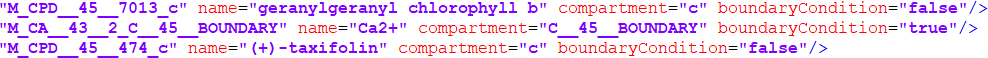
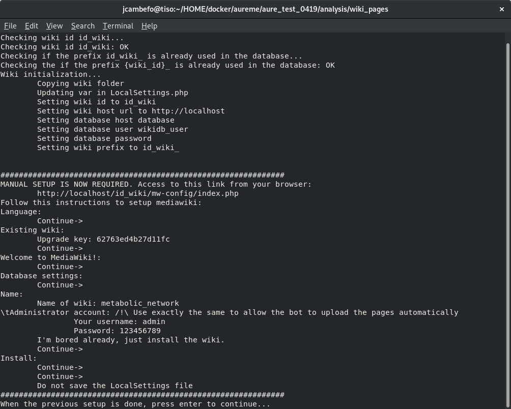
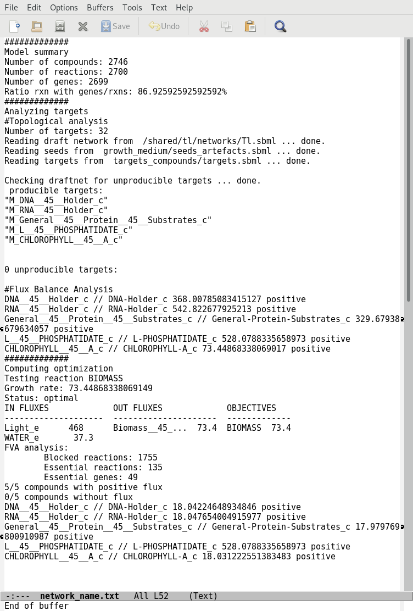

FAQ
===

Can I have a sample of AuReMe?
------------------------------

To get an overview of AuReMe, you can get a sample by using this
command:
::
 aureme> aureme --run=test --sample
 
You will get a folder named ‘aureme_sample’ in your bridge directory (i.e:
/home/data/run\_template/aureme_sample). This folder contains all input and o
utput files as if you had run the entire metabolic network reconstruction
workflow for the example files about *Tisochrysis lutea* (microalgae).
Look at the logs file to understand the different commands used in the
reconstruction process.

.. note:: if you do not want to pollute your log files when testing things
	  in your sample run, do not forget to use the **quiet (-q)**
	  argument in your command(s) if you wish **not** to store any log,
	  this way:
	  ::
	   aureme> aureme --run=aureme_sample --cmd="cmd args" -q 

.. _formats:

How to convert files to different formats?
------------------------------------------

The AuReMe workspace natively provides several functions for formats
conversion, through the
`PADMet Python package <https://pypi.org/project/padmet/>`_. The
available convertors are:

* From sbml to padmet format:
  ::
    aureme> aureme --run=test --cmd="draft"

This command will convert all sbml in networks folder of ‘**test**’
to one padmet. If you want to convert one sbml to padmet format,
simply put this file in networks folder of your run and make sure
there is no other sbml file nor padmet file, either in networks
directory, or in one of the sub-directory of networks. Then run
the command.

If you want to merge many sbml to one padmet, add all of them in
**networks > external_network** folder then run the command.
Ensure that there is no other sbml nor padmet file, either in
networks directory, or in one of the sub-directory of networks before
running the command. In the case one sbml would be forgotten, it
could add to the resulted **draft.padmet** or another reading error
could occur.

* From padmet to sbml format:
  ::
   aureme> aureme --run=test --cmd="padmet_to_sbml NETWORK=my_network [LVL=3]"

This command will convert the padmet file **my_network.padmet** from
networks folder of ‘**test**’ to create a sbml file **my_network.sbml**.
By default the sbml level is set to ‘**3**’, you can change the default
value in the config.txt file or with the argment LVL (3 or 2)

* From txt to sbml format:
  ::
   aureme> aureme --run=test --cmd="compounds_to_sbml CPD=/path/to/file/root_txt_file"

This command will convert a txt file containing compounds ids to a
sbml file **/path/to/txt_file.sbml**. The txt file must contain one
compound id by line and optionally the compartment of the id which
by default is ‘c’. Example of file:

                 +----------------------+
                 | | ATP                |
                 | | ADP                |
                 | | WATER\\tC-BOUNDARY |
                 | | LIGHT\\tC-BOUNDARY |
                 +----------------------+

* From GFF/GBK to FAA format:

.. note:: AuReMe integrate some scripts from
	  `padmet-utils tools <https://github.com/AuReMe/padmet-utils>`_,
	  for example, gbk_to_faa command use the script
	  /programs/padmet-utils/connection/gbk_to_faa.py. Not all
	  functions are encapsulated in AuReMe, there is a lot of scripts
	  that could be helpful. For more information, see
	  `https://github.com/AuReMe/padmet-utils <https://github.com/AuReMe/padmet-utils>`_.
	  ::
	   aureme> aureme --run=test --cmd="gbk_to_faa GBK_FILE=/path/to/gbk_file OUTPUT=/path/to/output_file"
	   
.. _growth_medium:

How to manage growth medium?
----------------------------

In AuReMe, a compound is defined as a part of the growth medium (or
‘seeds’ for gap-filling tools) if this compound is in the compartment
‘C-BOUNDARY’.

	    
The growth medium is linked to the metabolic network by two reactions,
a non-reversible reaction named ‘*TransportSeed-compound-id*’ which
transport a compound of the growth medium from the compartment
‘C-BOUNDARY’ to the ‘e’ (extra-cellular) and a reversible reaction named
‘*ExchangeSeed-compound-id*’ which exchange the same compound from ‘e’
to the ‘c’ (cytosol). When creating a sbml file, the compounds in the
‘C-BOUNDARY’ compartment will be set as ‘BOUNDARY-CONDITION=TRUE’ to
allow flux (see
`http://sbml.org/Documents/FAQ#What_is_this_.22boundary_condition.22_business.3F <http://sbml.org/Documents/FAQ#What_is_this_.22boundary_condition.22_business.3F>`_).

.. note:: Some metabolic networks manage the growth medium with a reversible
	  reaction which consume nothing and produce a compound in the ‘c’
	  compartment. We chose not to do the same for clarity and because
	  this metod made crash some dedicated tools for metabolic network .

* Get the list of compounds corresponding to the growth medium of a
  network in padmet format:
  ::
   aureme> aureme --run=test --cmd="get_medium NETWORK=network_name"

 Return a list of compounds or an empty list

* Set the growth medium of a network in padmet format:
  ::
   aureme> aureme --run=test --cmd="set_medium NETWORK=network_name [NEW_NETWORK=new_network_name]"

This command will remove the current growth medium if existing, then
create the new growth medium by adding the required reactions as
described before.

* Delete the growth medium of a network in padmet format:
  ::
   aureme> aureme --run=test --cmd="del_medium NETWORK=network_name [NEW_NETWORK=new_network_name]"

This function will remove all reactions consuming/producing a
compound in ‘C-BOUNDARY’ compartment.

.. warning:: If you don’t precise any **NEW_NETWORK** name, the current
	     network will be **overwritten**.

.. _compartment:

How to manage metabolic network compartment?
--------------------------------------------

In a metabolic network a compound can occur in different compartment.
Given a reaction transporting CA\ :sup:`2+` from ‘e’ (extra-cellular
compartment) to ‘c’ (cytosol compartment), the compartments involved are
‘e’ and ‘c’. It is important to properly manage the compartments defined
in a network to ensure a correct connection of the reactions. In some
case metabolic networks can use different id to define a same
compartment like ‘C_c’, ‘C’, ‘c’ for cytosol, merging those networks
could leak to a loss of network connectivity. A reaction producing
CA\ :sup:`2+` in ‘c’ and a reaction consuming CA\ :sup:`2+` in ‘C_c’ are
actually not connected, hence the interest of the metabolic network
compartment management commands of AuReMe.

* Get the complete list of compartment from a network in padmet format:
  ::
   aureme> aureme --run=test --cmd="get_compart NETWORK=network_name"

Return a list of compartment or an empty list.

* Change the id of a compartment from a network in padmet format:
  ::
   aureme> aureme --run=test --cmd="change_compart NETWORK=network_name OLD=old_id NEW=new_id [NEW_NETWORK=new_network_name]"

This command will change the id of the compartment ‘**old_id**’ to
‘**new_id**’. This command is required if different ids are used
to define a same compartment, example changing ‘C_c’ to ‘c’, or
‘C-c’ to ‘c’ ...

* Delete the id compartment from a network in padmet format:
  ::
   aureme> aureme --run=test --cmd="del_compart NETWORK=network_name compart=compart_id [NEW_NETWORK=new_network_name]"

This function will remove all reactions consuming/producing a
compound in ‘**compart_id**’ compartment.

.. warning:: If you don’t precise any **NEW_NETWORK** name, the current
	     network will be **overwritten**.

.. _artefacts:

What are “artefacts”?
---------------------

+------------------------------------------------------+--------------------------------------+
| | Meneco is a tool that fill the gaps topologically  | .. image:: pictures/artefacts.jpg    |
| | in a network, thanks to a reference database (see  |                                      |
| | the :ref:`meneco` section). In fact, Meneco cannot | | before gap-filling the network     | 
| | product any other metabolite of an cycle without   | | thanks to Meneco.                  |
| | initiate it before.                                |                                      |
| | Thereby, artefacts are metabolites allow Meneco to |                                      |
| | initiate cycles in a metabolic network.            |                                      |
| | For example in the picture aside, the Kreps cycle  |                                      |
| | needs to be initiated with Meneco. A manner to     |                                      |
| | initiate the Kreps cycle into Meneco is to put the |                                      |
| | "citrate" metabolite as one of the "artefacts"     |                                      |
+------------------------------------------------------+--------------------------------------+

How to explore the topology of a metabolic network?
---------------------------------------------------

A manner of exploring and analyzing the topology of a metabolic network is
to use the `MeneTools <https://pypi.org/project/MeneTools/>`_ (Metabolic
Network Topology Tools). Two MeneTools: Menecheck and Menescope are included
in AuReMe. You can run the one or the other individually.

+------------------------------------------+-------------------------------------------+
| **Input files**                          | **Result files**                          |   
|  .. image:: pictures/menetools_input.png |  .. image:: pictures/menetools_output.png |
+------------------------------------------+-------------------------------------------+

To obtain additional information about the file format of **artefacts.txt**,
**seeds.txt**, and **targets.txt**, please refer to :ref:`gap-filling_input`
and :ref:`artefacts` sections.

* Menecheck gives the producibility status using graph-based criteria.
  To run Menecheck, use this command:
  ::
   aureme> aureme --run=test --cmd="menecheck NETWORK=network_name"

* Menescope provides the topologically reachable compounds from seeds (and
  artefacts) in a metabolic network. To run Menescope, use this command:
  ::
   aureme> aureme --run=test --cmd="menescope NETWORK=network_name"

.. _log_file:

How to manage the log files?
----------------------------

By default, the system registers all the executed commands as a log in
the **bridge > test > log.txt** file. The whole output of these commands
will also be stored in another file: the **bridge > test > full_log.txt**
file.

If you DO NOT wish to store such logs, you can use the **quiet (-q)**
argument in your command(s). For example:
::
 aureme> aureme --run=test --cmd="some_commands" -q
 
It is possible to re-run a previous command by copying the corresponding
command line in the **bridge > test > log.txt** file, and pasting it in the
Docker container terminal.

To be able to reproduce the whole workflow applied in a previous study,
please see the :ref:`reproduce_study` section.

.. _reproduce_study:

How to reproduce studies?
-------------------------

If you want to re-run the complete workflow of a pre-run study, built
with AuReMe:

* First of all please create a new study (as described in the
  :ref:`new_study` section) by running the init command:
  ::
   aureme> aureme --init=my_run2

.. warning:: You can choose any run name you want, except pre-existing runs.
	     Please, avoid other special characters than ‘_’ and numbers).

It generates a new folder named **my_run2** in the **bridge** directory.

* Update your **config.txt** file, if it is needed.
  
*  Now, copy all the input data from the previous study in this new
   folder (please, follow the folder architecture described in the
   :ref:`organization` section).

*  Copy also the **log.txt** file in the **bridge > my_run2**
   directory, rename it (for example as run2.txt), and
   **change every occurrence of the previous run name by my_run2**.

*  Execute the previously created file.
   ::
    aureme> ./shared/my_run2/run2.txt

.. _a_la_carte:

How to create a new ‘à-la-carte’ workflow?
------------------------------------------

.. modifier config.txt (choix outil & bd) et ajouter un outil dans le container
   ajouter une cmd ds Makefile
   
If you want to add a new step in the workflow or add a new method, it is
possible to customize AuReMe. For that it is necessary to update the
Makefile in your run. Here is an example of how to do it.

-  Add a new method:

First, install your tool by following the documentation associated. For
the example we will add a new tool for orthology-based reconstruction
‘new_tool’ which use the same input as Pantograph (a metabolic network
in sbml format, a gbk of the reference species and the gbk of the study
species) and generate the same output (a metabolic network in sbml
format).

Secondly we will update the Makefile by adding these lines:

Basically this command says that for each folder in
orthology_based_reconstruction (variable declared in config.txt), if the
expected output is not already created, run new_tool.

Finally, to select this method in your new workflow, change in the file
config.txt the variable ORTHOLOGY_METHOD=pantograph by
ORTHOLOGY_METHOD=new_tool

-  Add a new step or function:

Just update the Makefile by adding a new step and use it with this
command

.. _choose_database:

How to choose another reference database?
-----------------------------------------

It is possible to select a reference database among several. You can
display the list of all available databases by using this command:

The reference database is needed to:

-  be able to match all the identifiers of the entities of metabolic
   networks

-  gap-fill the metabolic network in the gap-filling step

To select one, replace the corresponding path in the configuration file:
***config.txt***, in the ***DATA_BASE*** variable. Or you can comment
the line if you don’t want/can’t use a database. The ***config.txt***
file is stored at the root of your ***bridge*** folder (see :ref:`run_docker`).

.. _check_inputs:

What is checked in my input files?
----------------------------------

Before running any command in AuReMe, it is highlight recommended to use
the command ‘check_input’. This command checks the validity of the input
files and can also create required files. Concretely this command:

-  Checks database: If database was specified in the config.txt file
   (see the :ref:`choose_database` section). If so, checks if a sbml
   version exist and create it on the other hand.

-  Checks studied organism data: Search if there is a genbank (gbk/gff)
   ‘GBK_study.gbk’ and proteome (faa) ‘FAA_study.faa’ in genomic_data
   folder. If there is only a genbank, create the proteome (command
   ‘gbk_to_faa). If there is only the proteome or any of them, just
   continue the checking process. Note that the proteome is only
   required for the orthology-based reconstruction, method: Pantograph.

-  |image8|\ Checks orthology-based reconstruction data: for each folder
   found in ‘orthology_based_reconstruction’ folder checks in each of
   them if there is proteome ‘FAA_model.faa’ and a metabolic network
   ‘metabolic_model.sbml’, if there is no proteome but a genbank file
   ‘GBK_study.faa’, create the proteome (command ‘gbk_to_faa). Finally,
   the command compares the ids of genes/proteins between the proteome
   and the metabolic network.

If cutoff… important because… dict file to create a new proteome file …

-  Checks annotation-based reconstruction data: for each folder found in
   annotation_based_reconstruction’ folder checks in each of them if
   it’s a PGBD from pathway then create (if not already done) a padmet
   file ‘output_pathwaytools_’folder_name’.padmet in
   networks/output_annotation_based_reconstruction folder.

-  Checks gap-filling data: In order to gap-fill a metabolic network,
   Pantograph required as input, a file ‘seeds.sbml’ describing the
   seeds (the compounds available for the network), another describing
   the targets (the compounds that the network have to be able to
   reach), the metabolic network to fill and the database from where to
   draw the reactions all in sbml format. It’s possible to start from
   txt files for seeds ‘seeds.txt’ and targets ‘targets.txt’, each file
   containing the ids of the compounds, one by line. The command will
   then convert them to sbml (command ‘compounds_to_sbml’).

Note that by default, AuReMe will integrate the artefacts
‘default_artefacts_metacyc_20.0.txt’ to the seeds to create a file
‘seeds_artefacts.txt’ and ‘seeds_artefacts.sbml’. For more information
about the artefacts see :ref:`artefacts` section.

Example:

**[output] **

INSERT SCREEN FROM check_input log

What is the Makefile?
---------------------
Makefile contient les cmd de AuReMe.
exemple de cmd simple

What is the config.txt file?
----------------------------

The **config.txt** is found in the **bridge > test** directory. It contains
all the AuReMe parameters: the name of the selected database, the name of the
various choosen methods, and the default parameters of all programs that
AuReMe needed. 

If you want to use either another database or another tool already included in
the AuReMe workspace, modify carefully the **config.txt** file.

.. warning:: The parameters of the **config.txt** must not be changed unless
	     you are sure of what you want do!

How to regenerate a new database version?
-----------------------------------------

Voir les notes de Jeanne sur le problème de Sebastian

padmet/utils/connexion

.. _map_database:

How to map a metabolic network on another database?
---------------------------------------------------

Metabolic networks can be products of varied databases. If you want to
merge efficiently information about metabolic networks coming from
different databases, you will need to map the metabolic network(s) to a
common database. To do so, a solution is provided be AuReMe.

Note: to use this method, the metabolic network to map needs to be in
the SBML format and stored in the ***networks*** folder.

-  | First of all, you need to know the origin database of the data. To
     recognize the database used in an SBML file, use the ***which_db***
     command:
   | Example:

   **[output] **

-  When you know the origin database of the data, you have to generate
   the mapping dictionary from this database to the new one:

   Example:

   **[output] **

   In this example, the system has found more than just one mapping for
   the *R_R00494_c* reaction and the *S_Starch_p* compound. It did not
   manage to choose between the propositions: the mapping will not be
   added to the output mapping. If you want to force the mapping, you
   have to modify the mapping file manually.

-  Once you have created a mapping dictionary file, it will be
   automatically applied across the workflow to translate the data.

How to generate report on results?
----------------------------------

Create reports on the **network_name.padmet** file network (in the
**networks** directory).
::
 aureme> aureme --run=test --cmd="report NETWORK=network_name"

Four files are created in the **analysis > reports > network_name** directory
thanks to the report command.

* all_genes.csv (has the following format):
  ::
   id	      Common name   linked reactions
   TL_15991   Unknown	    2.3.1.180-RXN;RXN-9535
   TL_5857    Unknown	    RXN-14271;RXN-2425
   TL_6475    Unknown	    RXN-14229
  If a gene is linked with several reactions, reactions are separated from
  **";"**.

* all_metabolites.csv (has the following format):
  ::
   dbRef_id	  Common name	      Produced (p), Consumed (c), Both (cp)
   NAD-P-OR-NOP	  NAD(P)+	      cp
   THIOCYSTEINE	  thiocysteine	      p
   CPD-18346	  cis-vaccenoyl-CoA   c

* all_pathways.csv (has the following format):
  ::
   dbRef_id	Common name	                         Number of reaction found   Total number of reaction   Ratio (Reaction found / Total)
   COA-PWY-1	coenzyme A biosynthesis II (mammalian)	 1	                    1	                       1.00
   PWY-4984	urea cycle	                         1	                    5	                       0.20
   PWY-7821	tunicamycin biosynthesis	         1	                    9	                       0.11

* all_reactions.csv (has the following format):
  ::
   dbRef_id    Common name	                  formula (with id)	                                            formula (with common name)	                                                    in pathways	                    associated genes	        categories
   NDPK	       nucleoside-diphosphate kinase	  1.0 ATP + 1.0 DADP => 1.0 ADP + 1.0 DATP	                    1.0 ATP + 1.0 dADP => 1.0 ADP + 1.0 dATP		                                                            TL_16529;TL_13128	        ORTHOLOGY
   RXN-15122   ORF	                          1 THR => 1 PROTON + 1 CPD-15056 + 1 WATER	                    1 L-threonine => 1 H+ + 1 (2Z)-2-aminobut-2-enoate + 1 H2O	                    PWY-5437;ILEUSYN-PWY;PWY-5826   TL_17207;TL_12535;TL_8525   ANNOTATION;ANNOTATION;ORTHOLOGY
   SGPL11      sphinganine 1-phosphate aldolase   1.0 CPD-649 => 1.0 PALMITALDEHYDE + 1.0 PHOSPHORYL-ETHANOLAMINE   1.0 sphinganine 1-phosphate => 1.0 palmitaldehyde + 1.0 O-phosphoethanolamine                                   TL_105	                ORTHOLOGY
 In this file, if there are several data in the same field, data are
 separated from **";"**.
  
   
How to generate Wiki?
---------------------

+---------------------------------------------------------+----------------------------------------+
| | **Input files**                                       | .. image:: pictures/wiki.png           |
|                                                         |    :scale: 40%                         |
| .. image:: pictures/wiki_input.png                      |    :alt: Wiki visualization in Aureme. |
|    :alt: Input files needed to generate a wiki.         |                                        |
|                                                         |                                        |
| | **Result files**                                      |                                        |
|                                                         |                                        |
|    .. image:: pictures/wiki_output.png                  |                                        |
|       :alt: Output directories are generated in AuReMe. |                                        |
+---------------------------------------------------------+----------------------------------------+

Requirements
~~~~~~~~~~~~

1. Utilize AuReMe, to create the wiki pages from a metabolic network.

   An input file **network_name.padmet** inside the **brigde > test > networks**
   directory is needed. The wiki pages will be deployed in **brigde > test**
   **> analysis > wiki_pages > network_name**. 
   ::
    aureme> aureme --run=test --cmd="wiki_pages NETWORK=network_name"

.. warning:: Run all the next commands from your machine and not from the AuReMe
	     container.

You can use wikis to analyze or visualize your metabolic networks, thanks to
the `MediaWiki <https://www.mediawiki.org/wiki/MediaWiki>`_ technology. 

2. Clone the wiki software within your computer:
   ::
    shell> git clone https://github.com/AuReMe/wiki-metabolic-network.git
    shell> cd wiki-metabolic-network/wiki-metabolic-network/
    shell> make init

   The **wiki-metabolic-network** is now installed on your computer. You can
   manage it in using the `docker.com <https://www.docker.com/>`_ commands
   (see :ref:`tips_docker`). wiki-metabolic-network is an image that allows to
   automatize the creation of wikis in a container.

      
* Get the name of the wiki container, it will be usefull to run the next
  command.
    
   .. image:: pictures/docker_cmd.jpg
      :scale: 90 %
      :alt: List of the containers with these usefull for the wiki.

.. warning:: For a shake of genericity, in the following steps of this manual,
	     we will employ the term of **wiki_cont** instead of
	     **wikimetabolic_mediawiki_1** (the real one you have to write in
	     your command lines). 

* To enter the wiki container.
  ::
   shell> docker exec -it wiki_cont bash
    
* To print the commands of the wiki container.
  ::
   shell> docker exec -it wiki_cont wiki --help
    
* Copy the data previously created thanks to AuReMe, in the wiki container.
  ::
   shell> docker cp /test/analysis/wiki_pages/network_name wiki_cont:/home/

.. _wiki_create:

Wiki creation
~~~~~~~~~~~~~

**Follow the instructions on your terminal.**
::
 shell> docker exec -ti wiki_cont wiki --init=id_wiki

1. Open your browser at the following address:
   **http://localhost/id_wiki/mw-config/index.php**, and press **"Continue"**.
     
   .. image:: pictures/configure_wiki_2.png
      :scale: 60 %
      :alt: First step of the instructions of wiki configuration.

2. Get the **"Upgrade key"**. The **Upgrade key** is found on the your
   terminal. This is a small part extracted from the terminal to locate it
   better.

   .. image:: pictures/configure_wiki_3.png
      :scale: 100 %
      :alt: Second step of the instructions of wiki configuration.
     
3. Enter the **"Upgrade key"**, and press **"Continue"**.

   .. image:: pictures/configure_wiki_4.png
      :scale: 60 %
      :alt: Third step of the instructions of wiki configuration.

4. In the page  **"Welcome to MediaWiki"** configuration, just press
   **"Continue"**.

   .. image:: pictures/configure_wiki_5.png
      :scale: 60 %
      :alt: Fourth step of the instructions of wiki configuration.

5. In the page  **"Database settings"** configuration, just press
   **"Continue"**.

   .. image:: pictures/configure_wiki_6.png
      :scale: 60 %
      :alt: Fifth step of the instructions of wiki configuration.

6. In the page  **"Name"** configuration, you have several fields to fill:
     
   a. Name of wiki: **wiki_name**
   b. Your username: **admin**
   c. Password: Enter a password (it is at least 8 characters).
   d. Password again: Enter the same password.
   e. Email address: jeanne.got[at]irisa.fr (for example)
   f. Please select the phrase: **"I'm bored already, just install the wiki"**.
   g. Press **"Continue"**.

   .. image:: pictures/configure_wiki_7.png
      :scale: 60 %
      :alt: Sixth step of the instructions of wiki configuration.

7. In the first page of **"Install"**, just press **"Continue**.

   .. image:: pictures/configure_wiki_8.png
      :scale: 60 %
      :alt: Seventh step of the instructions of wiki configuration.

8. In the second page of **"Install"**, just press **"Continue**.

   .. image:: pictures/configure_wiki_9.png
      :scale: 60 %
      :alt: Eighth step of the instructions of wiki configuration.

9. Do not download the LocalSettings.php file.

10. **Go back to your terminal, and press "Enter".** The wiki is now online
    and reachable at this link:
    **http://localhost/id_wiki/index.php/Main_Page**.

* To send the "wiki pages" (that you previously copied in the wiki_cont
  container) on the wiki.
  ::
   shell> docker exec -ti wiki_cont wiki_load --action=load --url=http://localhost/id_wiki/api.php --user=admin --password=my_password --wikipage=/home/network_name --bots=2 -v
  Here **"bots"** is the number of CPUs are allocated to make this task.

* Now wiki pages are accessible on **http://localhost/id_wiki/index.php**.
  The following picture shows some functionalities of the wiki.
  
  .. image:: pictures/wiki_func.jpg
     :scale: 100 %
     :alt: Some functionalities of the wiki

Public and private access
~~~~~~~~~~~~~~~~~~~~~~~~~

.. note:: By default, a **"public access"** wiki is created. A wiki with a
	  public access means, a wiki which everyone is allowed to access and
	  to edit it on condition that she/he has an account on this wiki.

* To deploy a wiki with a **"private access"**.
  ::
   shell> docker exec -ti wiki_cont wiki --init=id_wiki --access=private

  Then, see the :ref:`wiki_create` section. A wiki with a **"private access"**
  is preventing access and editing for non-user. It also prevent account
  creation. It is useful to manage confidential data.

* To modify the access of a wiki already created.
  ::
   shell> docker exec -ti wiki_cont wiki --id=id_wiki --access=private
   shell> docker exec -ti wiki_cont wiki --id=id_wiki --access=public
   
Other wiki commands
~~~~~~~~~~~~~~~~~~~

* To list all deployed wiki use.
  ::
   shell> docker exec -ti wiki_cont wiki --all
   All deployed wiki:
           C_elegans
           E_siliculosus
	   id_wiki
           S_cerevisiae

* To remove a wiki use.
  ::
   shell> docker exec -ti wiki_cont wiki --id=id_wiki --remove
   Removing wiki id_wiki
   Removing wiki folder
   97 tables to drop

  It removes the "id_wiki" from wiki_folders and removes tables from database
  which start with prefix id_wiki.

* To reset a wiki use.
  ::
   shell> docker exec -ti wiki_cont wiki --id=id_wiki --clean
   id_wiki_page table to empty

  It only remove all the pages of the specified wiki. It keeps tables and
  folder associated with this wiki.

How to connect to Pathway-tools?
--------------------------------

.. XXX
   on prend un PGDB, on crée un padmet, on modifie le padmet (par exemple en
   ajoutant une réaction), et on génère de nouveau un PGDB que l'on peut ouvrir
   dans Pathway Tools.
   
-  Create PGDB from output of AuReMe

.. _objective_reaction:

How to set an objective reaction?
---------------------------------

To add a biomass reaction to a network, see the :ref:`create_new_reaction`
section. Once the biomass is included in the network, you have to set the
biomass as objective function.

Apply this command to the **network_name.padmet**
::
 aureme> aureme --run=test --cmd="set_fba ID=reaction_name NETWORK=network_name"

It creates the **network_name.sbml** file with reaction_name as the objective
function. To continue the analyzis of the network_name, see the :ref:`fba`
section. 

.. _fba:

How to process Flux Balance Analysis?
-------------------------------------

AuReMe evaluate the flux balance analyzis of the biological network, thanks to
the `cobrapy Python package <https://pypi.org/project/cobra/>`_.
Before calculating the flux balance analysis of a network:

a. you may have to add the biomass to a network in reporting to the
   :ref:`create_new_reaction` section,
b. you have to set the biomass as an objective reaction, please refer to the
   :ref:`objective_reaction` section.

To compute the flux balance analyzis of the **network_name.sbml** file:
::
 aureme> aureme --run=test --cmd="summary NETWORK=network_name"

Two files: **network_name.txt** and **network_name_log.txt** are generated
in the **analysis > flux_analysis** directory. The first file
(**network_name.txt**) summarizes te network, then it get the list of
productible and unproductible targets. For each productible target, the flux
balance analysis is given. The growth rate of the network is also provided.
Here is an example of a **network_name.txt** format:

	 
The second file (**network_name_log.txt**) supplies all the warnings produced
computing the flux balance analyzis.

